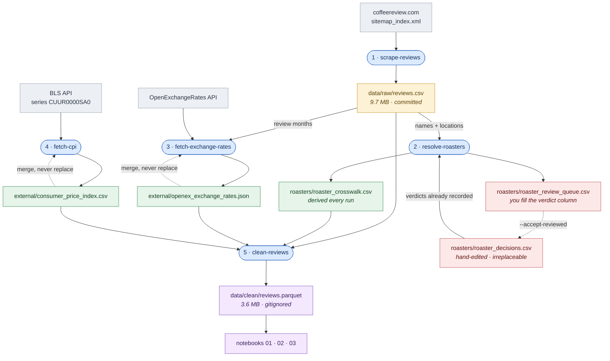

# Data flow

Every file under `data/`, what writes it, and what reads it. `uv run refresh-data`
runs the four commands top to bottom; the notebooks pick up where it stops.

Dotted edges are the loops: a file read by the same command that writes it.
Both reference fetchers merge into what is already held rather than replacing it,
and the review queue feeds back into the decisions file when you pass
`--accept-reviewed`.

## What can be rebuilt

| file | if you lost it | cost |
| --- | --- | --- |
| `raw/reviews.csv` | re-scrape | ~30 min, ~9,300 requests — and any review since removed from the site is gone |
| `roasters/roaster_decisions.csv` | **nothing rebuilds it** | every pair re-adjudicated by hand |
| `roasters/roaster_crosswalk.csv` | `resolve-roasters` | seconds |
| `roasters/roaster_review_queue.csv` | `resolve-roasters` | seconds |
| `external/openex_exchange_rates.json` | `fetch-exchange-rates --refetch` | 323 calls — a third of the monthly free tier |
| `external/consumer_price_index.csv` | `fetch-cpi --start-year 1990 --end-year 1999`, four times | four free calls |
| `clean/reviews.parquet` | `clean-reviews` | seconds |

The two ends of that table are why the formats differ. `roaster_decisions.csv`
is the only file nothing can regenerate, so it is small, plain text, and
committed. `clean/reviews.parquet` is rebuilt by one command and read only by
code, so it is Parquet and gitignored.

## Ordering

The four commands are not interchangeable:

- `resolve-roasters` needs `raw/reviews.csv` to exist
- `fetch-exchange-rates` reads its months from the **raw** layer, not the cleaned
  one — cleaning consumes the rates, so it cannot also be what produces the list
  of months to fetch
- `clean-reviews` needs all three reference files, though it runs without them
  and warns, leaving prices in their original currency
