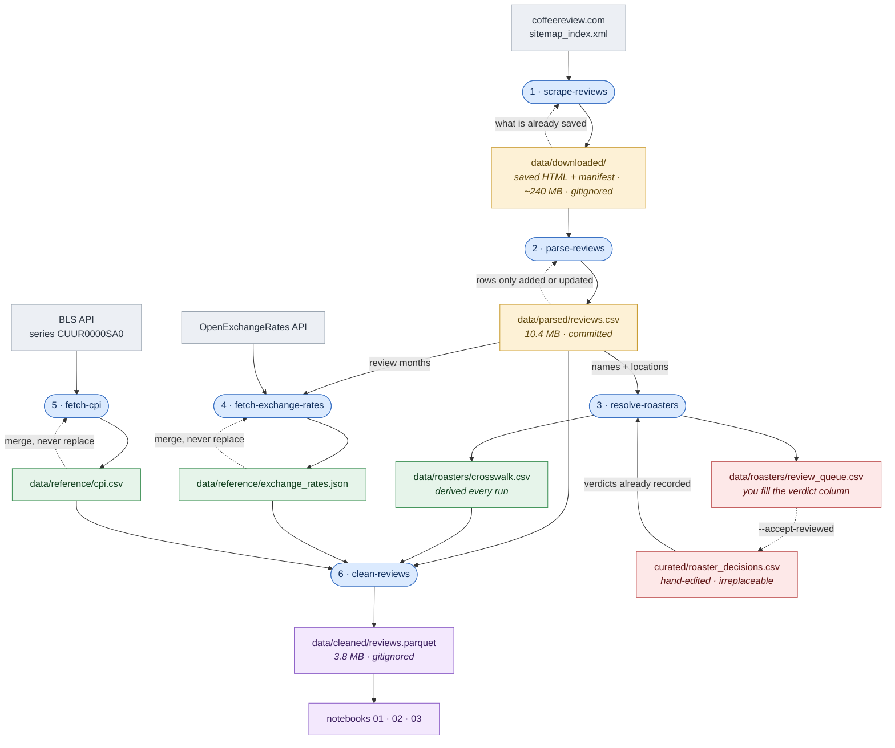

# Data flow

Every file under `data/` and `curated/`, what writes it, and what reads it. `uv run refresh-data`
runs the six commands top to bottom; the notebooks pick up where it stops.

```mermaid
flowchart TD
    classDef ext fill:#eceff4,stroke:#9aa5b1,color:#2b3440
    classDef cmd fill:#dbeafe,stroke:#3b72c4,color:#12305e
    classDef data fill:#fdf1d6,stroke:#c99a2e,color:#5c4409
    classDef ref fill:#e6f4ea,stroke:#3f9257,color:#12401f
    classDef out fill:#f3e8fd,stroke:#8b5cc7,color:#3d2060
    classDef human fill:#fde8e8,stroke:#c25a5a,color:#5e1414

    SITE["coffeereview.com<br/>sitemap_index.xml"]:::ext
    OXR["OpenExchangeRates API"]:::ext
    BLSAPI["BLS API<br/>series CUUR0000SA0"]:::ext

    SCRAPE(["1 · scrape-reviews"]):::cmd
    PARSE(["2 · parse-reviews"]):::cmd
    RESOLVE(["3 · resolve-roasters"]):::cmd
    FXCMD(["4 · fetch-exchange-rates"]):::cmd
    CPICMD(["5 · fetch-cpi"]):::cmd
    CLEAN(["6 · clean-reviews"]):::cmd

    DOWNLOADED["data/downloaded/<br/><i>saved HTML + manifest · ~240 MB · gitignored</i>"]:::data
    PARSED["data/parsed/reviews.csv<br/><i>10.4 MB · committed</i>"]:::data
    DEC["curated/roaster_decisions.csv<br/><i>hand-edited · irreplaceable</i>"]:::human
    QUEUE["data/roasters/review_queue.csv<br/><i>you fill the verdict column</i>"]:::human
    XWALK["data/roasters/crosswalk.csv<br/><i>derived every run</i>"]:::ref
    FX["data/reference/exchange_rates.json"]:::ref
    CPI["data/reference/cpi.csv"]:::ref
    CLEANED["data/cleaned/reviews.parquet<br/><i>3.8 MB · gitignored</i>"]:::out
    NB["notebooks 01 · 02 · 03"]:::out

    SITE --> SCRAPE --> DOWNLOADED
    DOWNLOADED -. "what is already saved" .-> SCRAPE
    DOWNLOADED --> PARSE --> PARSED
    PARSED -. "rows only added or updated" .-> PARSE

    PARSED -- "names + locations" --> RESOLVE
    DEC -- "verdicts already recorded" --> RESOLVE
    RESOLVE --> XWALK
    RESOLVE --> QUEUE
    QUEUE -. "--accept-reviewed" .-> DEC

    PARSED -- "review months" --> FXCMD
    OXR --> FXCMD
    FX -. "merge, never replace" .-> FXCMD
    FXCMD --> FX

    BLSAPI --> CPICMD
    CPI -. "merge, never replace" .-> CPICMD
    CPICMD --> CPI

    PARSED --> CLEAN
    XWALK --> CLEAN
    FX --> CLEAN
    CPI --> CLEAN
    CLEAN --> CLEANED --> NB
```

Dotted edges are the loops: a file read by the same command that writes it.
Both reference fetchers merge into what is already held rather than replacing it,
and the review queue feeds back into the decisions file when you pass
`--accept-reviewed`.

## What can be rebuilt

| file | if you lost it | cost |
| --- | --- | --- |
| `downloaded/` | `scrape-reviews` into an empty folder | ~30 min, ~9,300 requests; pages since removed from the site are gone |
| `parsed/reviews.csv` | `parse-reviews --full` from `downloaded/` | about a minute, no requests; reviews removed from the site before bronze held them are gone |
| `curated/roaster_decisions.csv` | **nothing rebuilds it** | every pair re-adjudicated by hand |
| `roasters/crosswalk.csv` | `resolve-roasters` | seconds |
| `roasters/review_queue.csv` | `resolve-roasters` | seconds |
| `reference/exchange_rates.json` | `fetch-exchange-rates --refetch` | 323 calls — a third of the monthly free tier |
| `reference/cpi.csv` | `fetch-cpi --start-year 1990 --end-year 1999`, four times | four free calls |
| `cleaned/reviews.parquet` | `clean-reviews` | seconds |

The two ends of that table are why the formats differ. `roaster_decisions.csv`
is the only file nothing can regenerate, so it is small, plain text, and
committed. `cleaned/reviews.parquet` is rebuilt by one command and read only by
code, so it is Parquet and gitignored.

## Ordering

The commands are not interchangeable:

- `parse-reviews` reads only what `scrape-reviews` saved
- `resolve-roasters` needs `parsed/reviews.csv` to exist
- `fetch-exchange-rates` reads its months from the **parsed** reviews, not the cleaned
  ones — cleaning consumes the rates, so it cannot also be what produces the list
  of months to fetch
- `clean-reviews` needs all three reference files, though it runs without them
  and warns, leaving prices in their original currency
